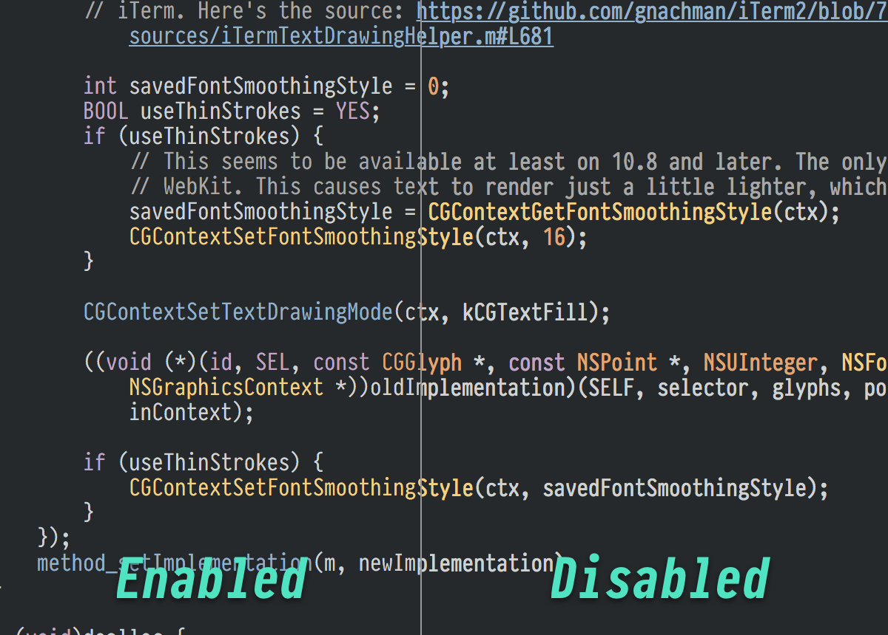

# ThinStrokes

ThinStrokes is an Xcode plugin that forces text to draw using "Thin Strokes" as applied in iTerm 2 for retina displays. 

## How does it work?

In a nutshell, the `NSLayoutManager` class is swizzled to force drawing with an undocumented smoothing mode, as done by iTerm in the following code:

https://github.com/gnachman/iTerm2/blob/76fe643f505eb3a0eed5a8390c39325e3c22d179/sources/iTermTextDrawingHelper.m#L681

This is probably a horrible idea, but it's way easier on the eyes! Bask in all its crisp glory!

## Installing ThinStrokes

Again, this is a horrible idea, so if stuff starts breaking randomly, don't say I didn't warn you...

Launch the Xcode project, build it, and relaunch Xcode. Eventually I'll figure out how to get this into "the list" for [Alcatraz](http://alcatraz.io).
